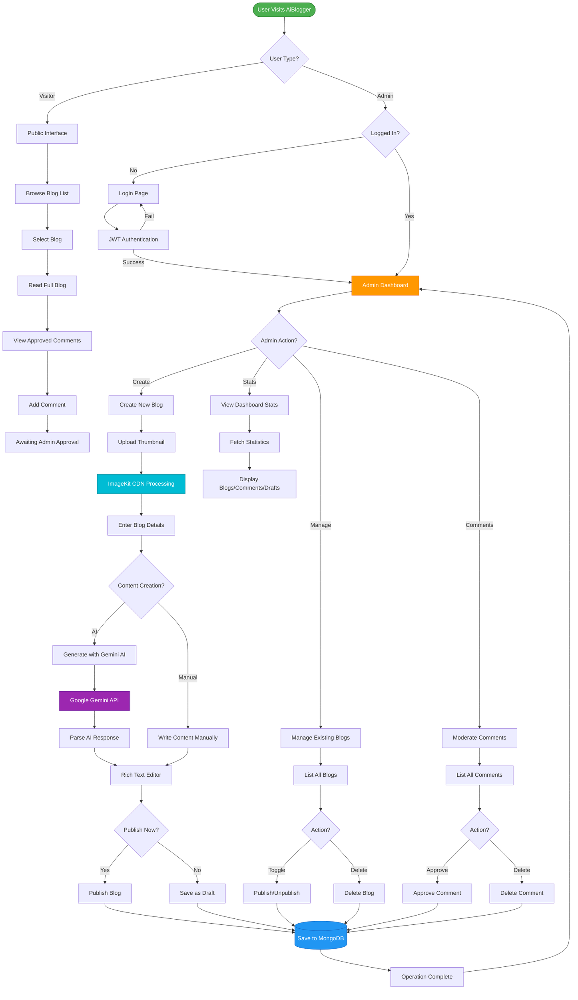
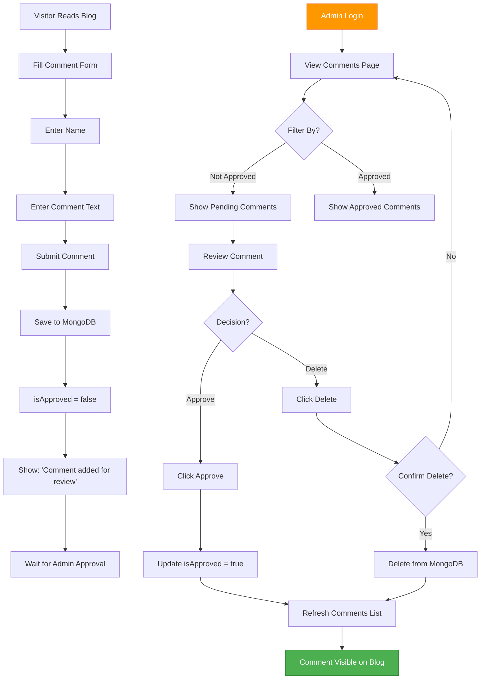
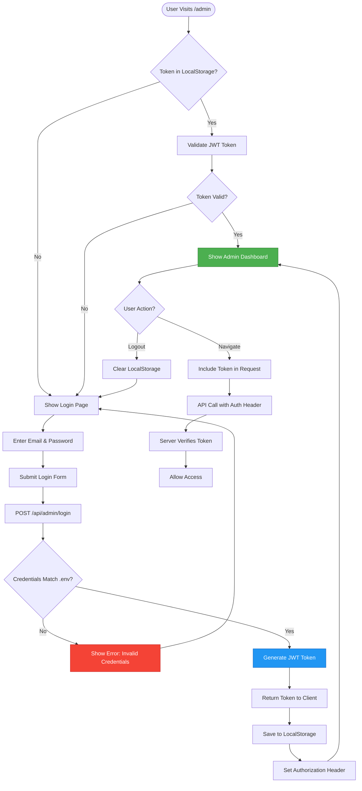
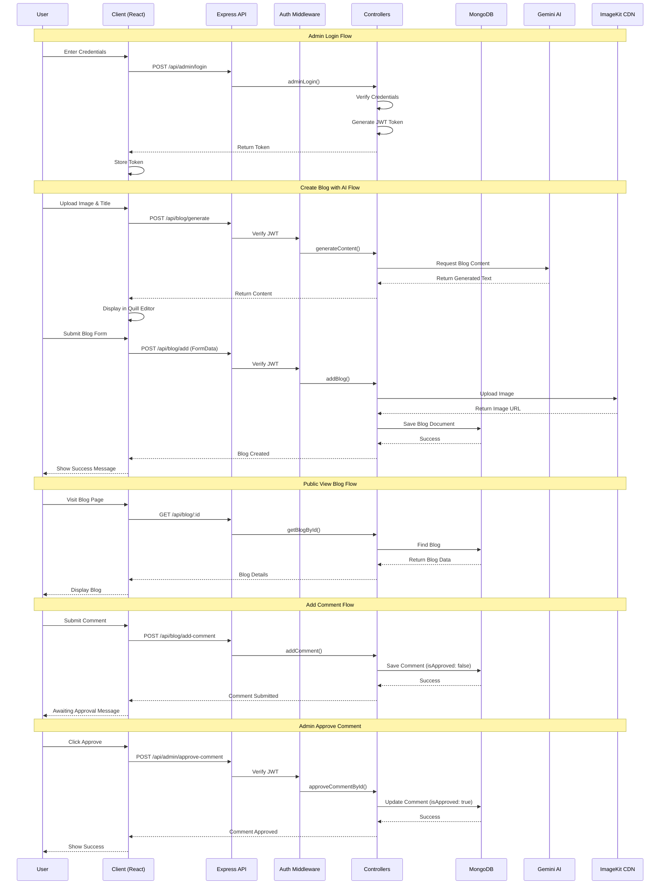

# AiBlogger 2.0 - Flowchart Documentation

This document contains comprehensive flowcharts for the AiBlogger application architecture and workflows.

---

## 1. User Flow Diagram

Complete user journey showing both visitor and admin paths through the application.



---

## 2. System Architecture Flowchart

Complete system overview showing all components and their connections.

```mermaid
graph TB
    subgraph "CLIENT - React + Vite"
        A[User/Visitor] --> B{Authenticated?}
        B -->|No| C[Public Pages]
        B -->|Yes| D[Admin Panel]
        
        C --> C1[Home - Blog List]
        C --> C2[Blog Details]
        C --> C3[Add Comment]
        
        D --> D1[Dashboard]
        D --> D2[Add Blog]
        D --> D3[List Blogs]
        D --> D4[Manage Comments]
        
        D2 --> D2a[Upload Image]
        D2 --> D2b[Enter Details]
        D2 --> D2c[AI Generate Content]
        D2 --> D2d[Publish/Draft]
    end
    
    subgraph "API - Express Server"
        E[Express Router]
        E --> F[Blog Routes]
        E --> G[Admin Routes]
        
        F --> F1[POST /add]
        F --> F2[GET /all]
        F --> F3[GET /:blogId]
        F --> F4[POST /delete]
        F --> F5[POST /toggle-publish]
        F --> F6[POST /add-comment]
        F --> F7[POST /comments]
        F --> F8[POST /generate]
        
        G --> G1[POST /login]
        G --> G2[GET /comments]
        G --> G3[GET /blogs]
        G --> G4[POST /delete-comment]
        G --> G5[POST /approve-comment]
        G --> G6[GET /dashboard]
    end
    
    subgraph "MIDDLEWARE"
        H1[JWT Auth]
        H2[Multer Upload]
        H3[CORS]
    end
    
    subgraph "CONTROLLERS"
        I1[Blog Controller]
        I2[Admin Controller]
    end
    
    subgraph "DATABASE"
        J[(MongoDB Atlas)]
        J --> K[Blog Collection]
        J --> L[Comment Collection]
    end
    
    subgraph "EXTERNAL SERVICES"
        M[ImageKit CDN]
        N[Google Gemini AI]
    end
    
    C1 --> F2
    C2 --> F3
    C3 --> F6
    
    D2 --> F1
    D2c --> F8
    D3 --> F5
    D3 --> F4
    D4 --> G2
    D4 --> G4
    D4 --> G5
    D1 --> G6
    
    F1 --> H1
    F1 --> H2
    F8 --> H1
    G2 --> H1
    G3 --> H1
    
    F --> I1
    G --> I2
    
    I1 --> J
    I2 --> J
    I1 --> M
    I1 --> N
    
    style J fill:#4CAF50,stroke:#2E7D32,color:#fff
    style M fill:#FF9800,stroke:#E65100,color:#fff
    style N fill:#9C27B0,stroke:#6A1B9A,color:#fff
```



---

## 3. Create Blog Flow

Detailed step-by-step process for creating a blog post with AI generation.

```mermaid
flowchart LR
    Start([Admin Logs In]) --> Dashboard[Admin Dashboard]
    Dashboard --> ClickAdd[Click 'Add Blog']
    ClickAdd --> Form[Blog Form Page]
    
    Form --> Step1[1. Upload Thumbnail Image]
    Step1 --> Step2[2. Enter Blog Title]
    Step2 --> Step3[3. Enter Subtitle]
    Step3 --> Step4[4. Choose Category]
    
    Step4 --> ContentDecision{How to create content?}
    
    ContentDecision -->|Manual| Manual[Write in Rich Text Editor]
    ContentDecision -->|AI| ClickAI[Click 'Generate with AI']
    
    ClickAI --> CheckTitle{Title Present?}
    CheckTitle -->|No| ShowError[Show Error: Title Required]
    ShowError --> Step2
    
    CheckTitle -->|Yes| CallAPI[POST /api/blog/generate]
    CallAPI --> SendPrompt[Send Title as Prompt]
    SendPrompt --> GeminiAPI[Gemini AI Processes]
    GeminiAPI --> ReturnContent[Return Generated Content]
    ReturnContent --> ParseMarkdown[Parse Markdown to HTML]
    ParseMarkdown --> FillEditor[Fill Quill Editor]
    
    Manual --> Editor[Rich Text Editor]
    FillEditor --> Editor
    
    Editor --> Step5[5. Review Content]
    Step5 --> Step6[6. Select Publish/Draft]
    
    Step6 --> PublishCheck{Publish Now?}
    PublishCheck -->|Yes| SetPublished[isPublished = true]
    PublishCheck -->|No| SetDraft[isPublished = false]
    
    SetPublished --> ClickSubmit[Click 'Add Blog']
    SetDraft --> ClickSubmit
    
    ClickSubmit --> UploadImage[Upload Image to ImageKit]
    UploadImage --> OptimizeImage[Optimize & Convert to WebP]
    OptimizeImage --> GetImageURL[Get CDN URL]
    
    GetImageURL --> CreateBlogDoc[Create Blog Document]
    CreateBlogDoc --> SaveMongo[Save to MongoDB]
    SaveMongo --> Success[Show Success Message]
    Success --> ResetForm[Reset Form]
    ResetForm --> Dashboard
    
    style GeminiAPI fill:#9C27B0,stroke:#6A1B9A,color:#fff
    style SaveMongo fill:#4CAF50,stroke:#2E7D32,color:#fff
```



---

## 4. Comment Moderation Flow

How comments are submitted by visitors and moderated by admins.



---

## 5. API Request Flow

How HTTP requests flow through the backend system.

```mermaid
flowchart LR
    Client[React Client] --> Request[HTTP Request]
    
    Request --> Router[Express Router]
    Router --> RouteCheck{Route Type?}
    
    RouteCheck -->|Public| PublicRoute[/api/blog/all<br/>/api/blog/:id<br/>/api/blog/comments]
    RouteCheck -->|Protected| AuthMiddleware[Auth Middleware]
    
    AuthMiddleware --> CheckToken{Valid JWT?}
    CheckToken -->|No| Return401[Return 401 Unauthorized]
    CheckToken -->|Yes| ProtectedRoute[Protected Endpoints]
    
    ProtectedRoute --> AdminRoute[/api/admin/*<br/>/api/blog/add<br/>/api/blog/generate]
    
    PublicRoute --> Controller[Controller Function]
    AdminRoute --> Controller
    
    Controller --> ProcessCheck{Needs Processing?}
    
    ProcessCheck -->|Upload| Multer[Multer Middleware]
    ProcessCheck -->|AI| Gemini[Gemini AI Call]
    ProcessCheck -->|Image| ImageKit[ImageKit CDN]
    ProcessCheck -->|No| DirectDB[Direct Database Call]
    
    Multer --> MongoDB[(MongoDB)]
    Gemini --> MongoDB
    ImageKit --> MongoDB
    DirectDB --> MongoDB
    
    MongoDB --> Result{Success?}
    
    Result -->|Yes| SuccessResponse[200 OK<br/>success: true<br/>data: ...]
    Result -->|No| ErrorResponse[500 Error<br/>success: false<br/>message: error]
    
    SuccessResponse --> Client
    ErrorResponse --> Client
    Return401 --> Client
    
    style SuccessResponse fill:#4CAF50,stroke:#2E7D32,color:#fff
    style ErrorResponse fill:#f44336,stroke:#c62828,color:#fff
    style Return401 fill:#FF9800,stroke:#E65100,color:#fff
```

---

## 6. Authentication Flow

JWT token-based authentication system for admin access.



---

## 7. Data Flow Sequence Diagram

Complete sequence of interactions between components.



---

## Technology Stack

### Frontend
- **React** - UI Library
- **Vite** - Build Tool
- **React Router** - Navigation
- **Quill** - Rich Text Editor
- **React Hot Toast** - Notifications
- **Marked** - Markdown Parser

### Backend
- **Express** - Web Framework
- **MongoDB** - Database
- **Mongoose** - ODM
- **JWT** - Authentication
- **Multer** - File Upload
- **CORS** - Cross-Origin Support

### External Services
- **Google Gemini AI** - AI Content Generation
- **ImageKit** - CDN & Image Optimization

---

## API Endpoints

### Blog Routes (`/api/blog`)
- `POST /add` - Create new blog (Protected)
- `GET /all` - Get all published blogs (Public)
- `GET /:blogId` - Get single blog (Public)
- `POST /delete` - Delete blog (Protected)
- `POST /toggle-publish` - Toggle publish status (Protected)
- `POST /add-comment` - Add comment (Public)
- `POST /comments` - Get approved comments (Public)
- `POST /generate` - Generate content with AI (Protected)

### Admin Routes (`/api/admin`)
- `POST /login` - Admin login (Public)
- `GET /comments` - Get all comments (Protected)
- `GET /blogs` - Get all blogs (Protected)
- `POST /delete-comment` - Delete comment (Protected)
- `POST /approve-comment` - Approve comment (Protected)
- `GET /dashboard` - Get dashboard stats (Protected)

---

## Database Schema

### Blog Collection
```javascript
{
  title: String,
  subTitle: String,
  description: String (HTML),
  category: String,
  image: String (CDN URL),
  isPublished: Boolean,
  createdAt: Date
}
```

### Comment Collection
```javascript
{
  blog: ObjectId (ref: Blog),
  name: String,
  content: String,
  isApproved: Boolean,
  createdAt: Date
}
```

---

## How to View These Diagrams

1. **GitHub/GitLab** - These platforms render Mermaid diagrams automatically
2. **VS Code** - Install "Markdown Preview Mermaid Support" extension
3. **Online** - Visit [mermaid.live](https://mermaid.live/) and paste the code
4. **Other Tools** - Any Markdown viewer with Mermaid support

---

## Project Structure

```
AiBlogger2.0/
├── client/                 # React Frontend
│   ├── src/
│   │   ├── components/    # Reusable components
│   │   ├── pages/         # Page components
│   │   ├── context/       # Context API
│   │   └── assets/        # Static assets
│   └── package.json
│
└── server/                # Express Backend
    ├── controllers/       # Business logic
    ├── models/           # MongoDB schemas
    ├── routes/           # API routes
    ├── middleware/       # Auth & file upload
    ├── configs/          # DB, Gemini, ImageKit
    └── package.json
```

---

**Created for AiBlogger 2.0** - A modern blog platform with AI-powered content generation
